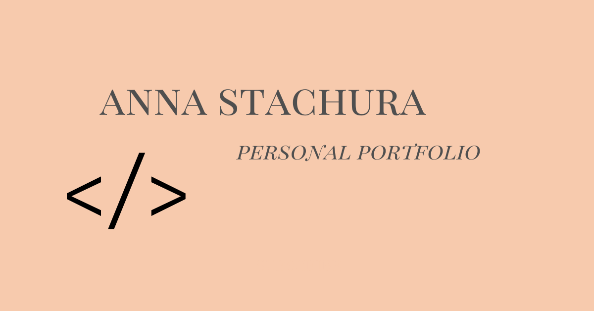

# Anna Stachura personal website
My personal website build during WTF course. 👌

## Tools & technologies I've used:

- Visual Studio Code
- SASS
- Fetch API
- Figma
- CSS
- Java Script
- HTML

## build with wtf gulp starter

`npm install -g gulp-cli`

`npm install`

`gulp`

To publish your page using github pages use `npm run deploy`
 
